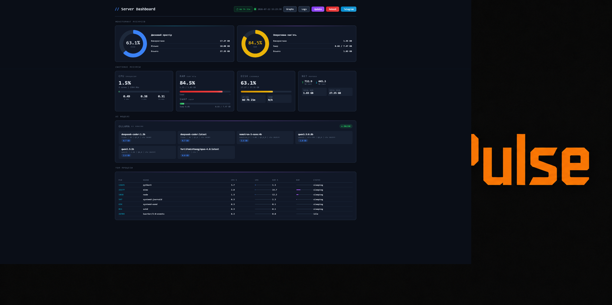
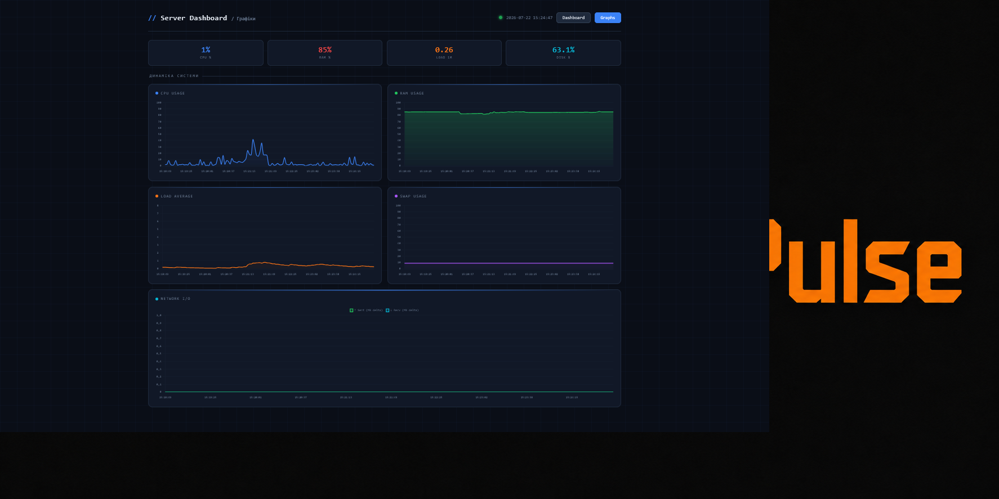

<p align="center">
  
</p>

<p align="center">
  <b>Real-time Server Monitoring Dashboard with Telegram Alerts</b>
</p>

<p align="center">
  
  
  
</p>

---

**ServerPulse** — lightweight server monitoring with a beautiful dark dashboard and proactive Telegram alerts. No external databases, no complex setup — just Python + Flask.

## Features

- **Real-time Dashboard** — CPU, RAM, disk, network, temperatures, processes
- **Live Graphs** — CPU/RAM history with smooth charts (6 min window)
- **Telegram Alerts** — proactive warnings when thresholds are exceeded
- **Smart Cooldowns** — no spam, alerts are deduplicated
- **Service Monitoring** — watches systemd services (nginx, ollama, etc.)
- **One-File Setup** — `app.py` + templates, that's it

## Screenshots

<p align="center">
  
</p>

<p align="center">
  
</p>

## Quick Start

```bash
# Clone
git clone https://github.com/borodachamba/serverpulse.git
cd serverpulse

# Install dependencies
pip install -r requirements.txt

# Set Telegram credentials (optional)
export BOT_TOKEN="your-telegram-bot-token"
export CHAT_ID="your-chat-id"

# Run
python app.py
```

Dashboard: `http://localhost:8080`

## Configuration

### Environment Variables

| Variable | Description | Default |
|----------|-------------|---------|
| `BOT_TOKEN` | Telegram bot token | built-in |
| `CHAT_ID` | Telegram chat ID | `1988483132` |

### Alert Thresholds

Edit `THRESHOLDS` in `app.py`:

```python
THRESHOLDS = {
    "cpu_high": 70,
    "cpu_critical": 90,
    "mem_high": 70,
    "mem_critical": 90,
    "disk_warning": 80,
    "disk_critical": 90,
    "swap_warning": 70,
    "load_critical_multiplier": 2.0,
}
```

## Deploy as System Service

```bash
# Copy service file
sudo cp dashboard.service /etc/systemd/system/
sudo systemctl daemon-reload
sudo systemctl enable --now dashboard

# Check status
sudo systemctl status dashboard
journalctl -u dashboard -f
```

## Project Structure

```
serverpulse/
├── app.py                 # Main application
├── templates/
│   ├── index.html         # Dashboard UI
│   └── graphs.html        # Live graphs page
├── img/
│   ├── logo.png           # Project logo
│   ├── icon.png           # Project icon
│   ├── index.png          # Dashboard screenshot
│   └── graphs.png         # Graphs screenshot
├── dashboard.service      # Systemd service file
├── requirements.txt       # Python dependencies
├── favicon.ico            # Favicon (multi-size)
├── LICENSE                # MIT License
└── README.md              # This file
```

## Tech Stack

- **Backend:** Python 3.10+, Flask, psutil
- **Frontend:** HTML5, Chart.js, CSS3 (dark theme)
- **Alerts:** Telegram Bot API
- **Deploy:** systemd, nginx reverse proxy

## How It Works

1. `app.py` collects system metrics via `psutil` every 3 seconds
2. Dashboard fetches `/api/system` via AJAX and renders live charts
3. `AlertManager` checks thresholds and sends Telegram messages
4. Cooldown system prevents alert spam (5 min for warnings, 1 min for critical)

## License

MIT License — Copyright (c) 1998-2026 Nick Antonov / Borodachamba Studio

See [LICENSE](LICENSE) for details.

## Author

**Nick Antonov** — [Borodachamba Studio](https://borodachamba.pp.ua)

---

<p align="center">
  Made with Python and caffeine
</p>
